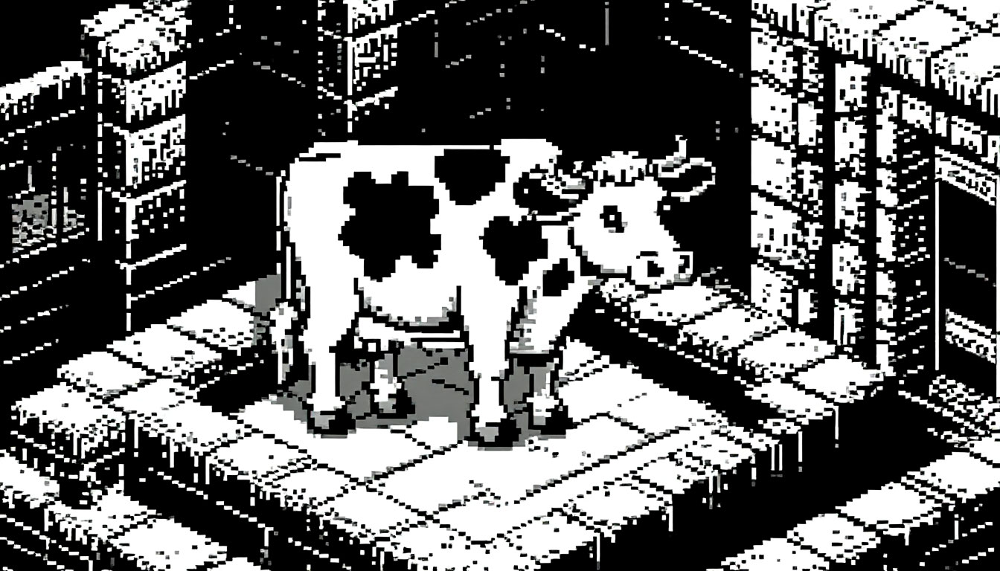

.. MUD documentation master file, created by
   sphinx-quickstart on Tue Apr  8 11:22:48 2025.
   You can adapt this file completely to your liking, but it should at least
   contain the root `toctree` directive.

MUD documentation
=================

Документация самого лучшего **Multi User Dungeon** на свете!
*Картинка не отражает качество игрового продукта*

Формулировка задания
--------------------
*Просили скопипастить... вот, пожалуйста*

* Для модуля-сервера задокументировать все функции, классы и модуль в формате autodoc
* Добиться выгонки технической документации по этим классам/функциям/модулю
* Следить за тем, чтобы генераты (html-документация) не хранились в git (.gitignore), а настойки shpinx — хранились
* Оформить титульный лист документации (**как минимум, скопипастить туда формулировку задачи**)
* Сделать в титульном листе ссылку на техническую документацию

Техническая документация
------------------------

.. image:: _static/python.png

.. toctree::
   :maxdepth: 2
   :caption: Содержание:

   API
